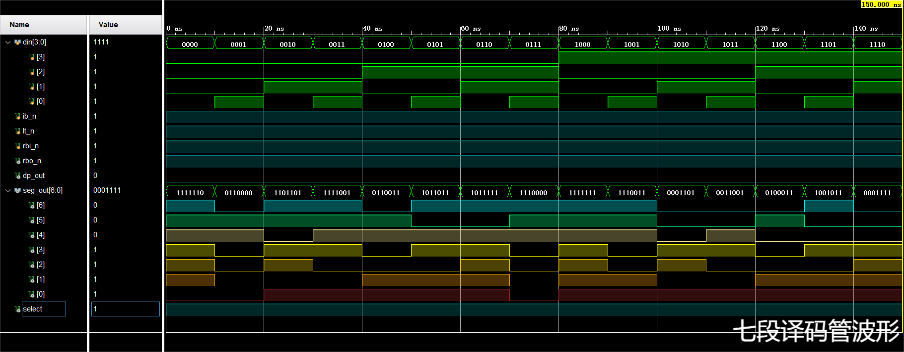

# 实验报告一

[TOC]


## 实验内容

组合逻辑基础模块：

- 8-3优先编码器
- 3-8译码器
- 四位数据比较器
- 七段译码器

## 8-3优先编码器

### 设计思路

输出信号为$3$位，即用$3$位二进制表示$0-7$这$8$个数，权重从高到低；输入信号为$8$位，优先级从高到低。

当有多个输入时，对优先级最高的进行编码，其它低位对编码结果无影响。使用`casez`语句实现这一功能，有效位为$1$，比它优先级高的设为$0$，比它优先级低的设为$?$。

### 主要代码

```verilog
/*
 * 8-3优先编码器
 *
 * 输入：8位（高有效 SW7-SW0）
 * 输出：3位（低有效 LD2 2-0）
 */


module priority_encoder_83(
    din ,  // 输入(SW7-SW0)
    dout   // 输出(LD2 2-0)
);
    input        [7:0]  din;
    output  reg  [2:0]  dout;

    always @(*)
    begin
        casez (din)
            // 76543210
            8'b00000001: dout = 3'b000;
            8'b0000001?: dout = 3'b001;
            8'b000001??: dout = 3'b010;
            8'b00001???: dout = 3'b011;
            8'b0001????: dout = 3'b100;
            8'b001?????: dout = 3'b101;
            8'b01??????: dout = 3'b110;
            8'b1???????: dout = 3'b111;
            default:     dout = 3'b000;
        endcase
    end

endmodule
```

### 仿真结果


### 测试结果


## 3-8译码器

### 设计思路

输出为$8$位；输入为$3$位，用$3$位二进制表示$0-7$这8个数。

实现输入的十进制数用对应的信号为$1$即信号灯亮起表示，例如输入是$6$，第$2$个灯亮起，输入是$4$，第$4$个灯亮起。

### 主要代码

```verilog
/*
 * 3-8译码器
 *
 * 输入：3位（SW2-SW0）
 * 输出：8位（高有效，LD2 7-0）
 */


module decoder_38(
    din ,  // 输入(SW2-SW0)
    dout   // 输出(LD2 7-0)
);
    input        [2:0]  din ;
    output  reg  [7:0]  dout;

    always @(*) begin
        case (din)
            3'b000: dout = 8'b00000001;
            3'b001: dout = 8'b00000010;
            3'b010: dout = 8'b00000100;
            3'b011: dout = 8'b00001000;
            3'b100: dout = 8'b00010000;
            3'b101: dout = 8'b00100000;
            3'b110: dout = 8'b01000000;
            3'b111: dout = 8'b10000000;
            default dout = 8'b00000000;
        endcase
    end

endmodule

```

### 仿真结果


### 测试结果


## 四位数据比较器

### 设计思路

输出为$3$位，第一位高电平表示第一个输入较大，第三位高电平表示第二个输入较大，第二位高电平表示两个输入相等；输入为两个$4$位二进制数。

### 主要代码

```verilog
/*
 * 四位数据比较器
 *
 * 输入：两个4位，数据A（SW7-SW4），数据B（SW3-SW0）
 * 输出：3位（LD2 2-0）
 */


module comparator_4(
    din1,  // 数据A(SW7-SW4)
    din2,  // 数据B(SW3-SW0)
    dout   // 输出(LD2 2-0)
);

    input        [3:0]  din1;  // A: SW7-SW4
    input        [3:0]  din2;  // B: SW3-SW0
    output  reg  [2:0]  dout;

    always @(*)
    begin
        if (din1 > din2)
            begin
                dout = 3'b100;
            end
        else if (din1 < din2)
            begin
                dout = 3'b001;
            end
        else
            begin
                dout = 3'b010;
            end
    end

endmodule

```

### 仿真结果


### 测试结果


## 七段译码器

### 设计思路

输出包括灭零信号输出（低有效），七段数码管显示，小数点显示和位选信号

- 灭零信号输出：当灭零信号输入有效且输入为$0$时，灭零信号输出有效，考虑到完备性，设定当灭灯信号输入有效或测灯信号有效时灭零信号均为无效，其余情况均为灭零信号也均为无效；
- 七段数码管显示：如下图，需要亮起的管设定为$1$：当灭灯信号有效时，全灭；当测灯信号有效时，全亮；当输入为$0$且灭零信号有效时，全灭，其余情况正常显示数字；


- 小数点显示：当灭灯信号有效时，小数点信号灯灭；当测灯信号有效时，小数点灯亮起；当灭零信号有效且输入为0时，小数点信号灭；其余情况小数点灯灭；

输入包括$4$位输入（即用$4$位二进制表示$0-15$这$16$个数），测灯信号，灭灯信号，灭零信号输入。

### 主要代码

```verilog
/*
 * 七段译码管
 *
 * 输入：4位（SW3-SW0）
 *      灭灯信号（低有效，优先级最高，SW7）
 *      测灯信号（低有效，优先级第二，SW6）
 *      灭零信号输入（低有效，SW5）
 * 输出：灭零信号输出（低有效，LD2 0）
 *      显示输出（数字和小数点）
 *      位选信号（BIT8 G6）
 */


// 低电平有效
module seven_segment_decoder(
    din    ,  // 4位输入(SW3-SW0)
    ib_n   ,  // 灭灯信号1(SW7)
    lt_n   ,  // 测灯信号2(SW6)
    rbi_n  ,  // 灭零信号输入(SW5)
    rbo_n  ,  // 灭零信号输出(LD2 0)
    seg_out,  // 七段数码管显示输出
    dp_out ,  // 小数点显示信号
    select    // 位选信号(BIT8 G6)
);

    input        [3:0]  din    ;  // 4位输入
    input               ib_n   ;  // 灭灯信号1`
    input               lt_n   ;  // 测灯信号2`
    input               rbi_n  ;  // 灭零信号输入
    output  reg         rbo_n  ;  // 灭零信号输出
    output  reg  [6:0]  seg_out;  // 七段数码管输出信号
    output  reg         dp_out ;  // 小数点显示信号
    output  reg         select = 1'b1;  // 位选信号

    // rbo_n
    always @(*)
    begin
        if (ib_n == 1'b0)
            begin
                rbo_n = 1'b1;
            end
        else if (lt_n == 1'b0)
            begin
                rbo_n = 1'b1;
            end
        // 灭零
        else if ((rbi_n == 1'b0) && (din == 4'b0000))
            begin
                rbo_n = 1'b0;
            end
        else
            begin
                rbo_n = 1'b1;
            end
    end

    // seg_out
    always @(*)
    begin
        // 灭灯
        if (ib_n == 1'b0)
            begin
                seg_out = 7'b0000000;
            end
        // 测灯
        else if (lt_n == 1'b0)
            begin
                seg_out = 7'b1111111;
            end
        // 灭零
        else if ((rbi_n == 1'b0) && (din == 4'b0000))
            begin
                seg_out = 7'b0000000;
            end
        // 正常显示数字
        else
            begin
                case (din)
                    //       seg_out = 7'bABCDEFG
                    4'b0000: seg_out = 7'b1111110;
                    4'b0001: seg_out = 7'b0110000;
                    4'b0010: seg_out = 7'b1101101;
                    4'b0011: seg_out = 7'b1111001;
                    4'b0100: seg_out = 7'b0110011;
                    4'b0101: seg_out = 7'b1011011;
                    4'b0110: seg_out = 7'b1011111;
                    4'b0111: seg_out = 7'b1110000;
                    4'b1000: seg_out = 7'b1111111;
                    4'b1001: seg_out = 7'b1110011;
                    4'b1010: seg_out = 7'b0001101;
                    4'b1011: seg_out = 7'b0011001;
                    4'b1100: seg_out = 7'b0100011;
                    4'b1101: seg_out = 7'b1001011;
                    4'b1110: seg_out = 7'b0001111;
                    4'b1111: seg_out = 7'b0000000;
                    default  seg_out = 7'b0000000;
                endcase
            end
    end

    // dp_out
    always @(*)
    begin
        // 灭灯
        if (ib_n == 1'b0)
            begin
                dp_out = 1'b0;
            end
        // 测灯
        else if (lt_n == 1'b0)
            begin
                dp_out = 1'b1;
            end
        // 灭零
        else if ((rbi_n == 1'b0) && (din == 4'b0000))
            begin
                dp_out = 1'b0;
            end
        else
            begin
                dp_out = 1'b0;
            end
    end

endmodule

```

### 仿真结果



### 测试结果


## 附件

附加内容为$4$个实验的`.bit`文件和4个实验的测试视频。
