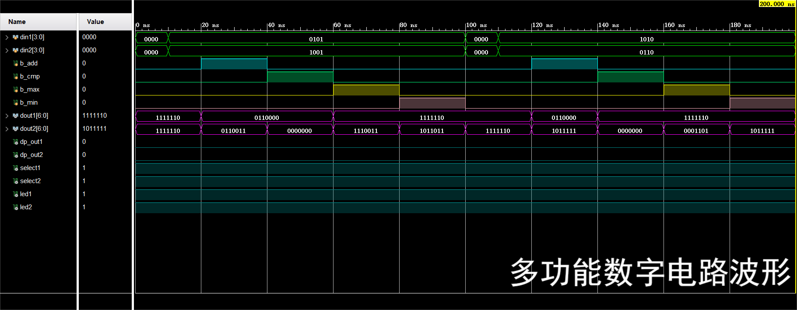
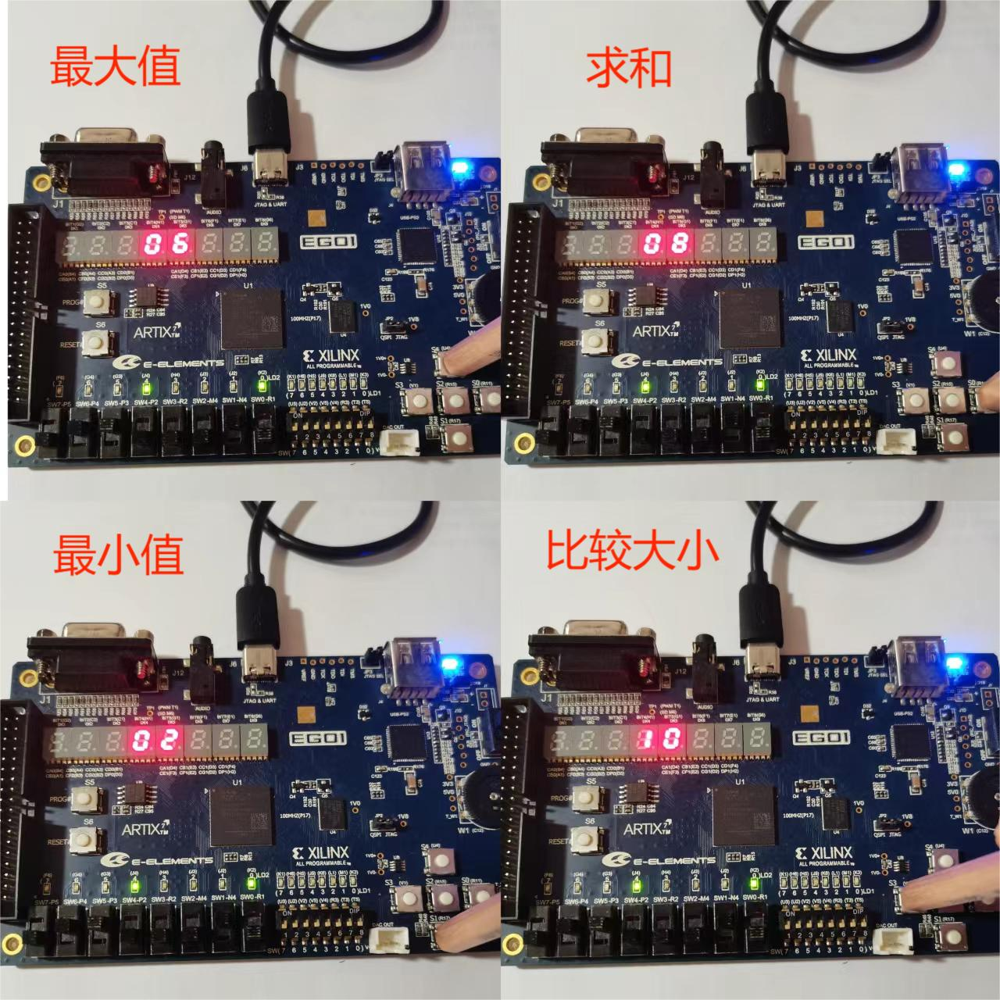

# 实验报告二

[TOC]

## 实验内容

多功能数字电路模块

- 求和模块
- 比较大小模块
- 输出最大值模块
- 输出最小值模块

## 顶层模块

### 设计思路

顶层模块分别实例化**求和、比较大小，输出最大值、最小值和七段译码器**这$5$个子模块，其中七段译码器与实验一完全相同，其它子模块将在后面详细说明

### 主要代码

```verilog
`include "select.v"
`include "mmin.v"
`include "mmax.v"
`include "adder.v"
`include "comparator.v"
`include "seven_segment_decoder.v"

module multifunction(
    din1   ,  // 数据A
    din2   ,  // 数据B

    b_add  ,  // 求和按钮
    b_cmp  ,  // 比较按钮
    b_max  ,  // 最大值按钮
    b_min  ,  // 最小值按钮

    dout1  ,  // 高位输出
    dout2  ,  // 低位输出
    dp_out1,  // 高位小数点
    dp_out2,  // 低位小数点

    select1,
    select2,
    led1   ,
    led2
);
    input   [3:0]  din1;
    input   [3:0]  din2;

    input          b_add;
    input          b_cmp;
    input          b_max;
    input          b_min;

    output  [6:0]  dout1;
    output  [6:0]  dout2;
    output         dp_out1;
    output         dp_out2;

    output select1;
    output select2;
    output led1;
    output led2;

    // 中间变量，存储各功能模块输出
    wire    [3:0]  la1;
    wire    [3:0]  la2;
    wire    [3:0]  lc1;
    wire    [3:0]  lc2;
    wire    [3:0]  lm1;
    wire    [3:0]  lm2;
    wire    [3:0]  ln1;
    wire    [3:0]  ln2;

    wire    [3:0]  lout1;
    wire    [3:0]  lout2;


    /**
     * 实例化选择模块
     * 输入：来自四个功能模块
     * 输出：输给给七段数码管
     */
    select u_select(
        .button_add ( b_add ),
        .button_cmp ( b_cmp ),
        .button_max ( b_max ),
        .button_min ( b_min ),

        .add_h      ( la1   ),
        .add_l      ( la2   ),
        .cmp_h      ( lc1   ),
        .cmp_l      ( lc2   ),
        .max_h      ( lm1   ),
        .max_l      ( lm2   ),
        .min_h      ( ln1   ),
        .min_l      ( ln2   ),

        .out_h      ( lout1 ),
        .out_l      ( lout2 )
    );


    // 实例化功能模块
    adder u_adder(
        .add_num1 ( din1  ),
        .add_num2 ( din2  ),
        .add_high ( la1   ),
        .add_low  ( la2   ),
        .add      ( b_add )
    );

    comparator u_comparator(
        .cmp_num1 ( din1  ),
        .cmp_num2 ( din2  ),
        .cmp_high ( lc1   ),
        .cmp_low  ( lc2   ),
        .compare  ( b_cmp )
    );

    mmax u_mmax(
        .max_num1 ( din1  ),
        .max_num2 ( din2  ),
        .max_high ( lm1   ),
        .max_low  ( lm2   ),
        .smax     ( b_max )
    );

    mmin u_mmin(
        .min_num1 ( din1  ),
        .min_num2 ( din2  ),
        .min_high ( ln1   ),
        .min_low  ( ln2   ),
        .smin     ( b_min )
    );


    // 七段数码管
    // 高位
    seven_segment_decoder u_seven_segment_decoder1(
        .din      ( lout1   ),
        .ib_n     ( 1'b1    ),
        .lt_n     ( 1'b1    ),
        .rbi_n    ( 1'b1    ),
        .rbo_n    ( led1    ),
        .seg_out  ( dout1   ),
        .dp_out   ( dp_out1 ),
        .select   ( select1 )
    );

    // 低位
    seven_segment_decoder u_seven_segment_decoder2(
        .din      ( lout2   ),
        .ib_n     ( 1'b1    ),
        .lt_n     ( 1'b1    ),
        .rbi_n    ( 1'b1    ),
        .rbo_n    ( led2    ),
        .seg_out  ( dout2   ),
        .dp_out   ( dp_out2 ),
        .select   ( select2 )
    );

endmodule
```

## 求和模块

### 设计思路

输出为两个$4$位二进制数（一个表示结果的十位，另一个表示结果的个位），选择加法功能的信号（高有效）；输入位两个4位二进制数，用$8421$码表示。

为了存储进位，首先将两个数扩展位$8$位，再相加，如果没超过$9$，直接赋值给个位输出；如果结果超过$9$，需要将结果加$6$，此时得到的输出高四位表示十位，低四位表示个位。

$4$位的$8421$码表示$0-9$这十个数，但是FPGA开发板输入的数据却能超过$9$，为了防止不合理的输入造成未知的问题，我们将超过$8421$码表示范围的数按照$8421$的权重赋值了$10-15$，并给出了对应的求和结果。这个设计仅仅为了防止未知错误，调用本模块时的输入应当在$0-9$范围内。

### 主要代码

```verilog
/*
 * 求和模块
 *
 * 输入：两个4位二进制数
 * 输出：两数之和
 */


module adder(
    add_num1,  // 数据A
    add_num2,  // 数据B
    add_high,  // 十位
    add_low ,  // 个位
    add        // 选择求和功能按钮
);
    input        [3:0]  add_num1;
    input        [3:0]  add_num2;
    output  reg  [3:0]  add_high;
    output  reg  [3:0]  add_low ;
    input               add     ;
            reg  [7:0]  expand  ;

    always @(*)
    begin
        expand = {4'b0000, add_num1} + {4'b0000, add_num2};
        if (expand > 8'b00011101)
            begin
                {add_high, add_low} = expand + 8'b00010010;
            end
        else if (expand > 8'b00010011)
            begin
                {add_high, add_low} = expand + 8'b00001100;
            end
        else if (expand > 8'b00001001)
            begin
                {add_high, add_low} = expand + 8'b00000110;
            end
        else
            begin
                {add_high, add_low} = expand              ;
            end
    end

endmodule
```

## 比较大小模块

### 设计思路

输出为两个$4$位二进制数，当第一个输入较大时，第一个输出为$1$，当第二个输入较大时，第二个输出为$1$，当两个输入相等时，两个输出均为$1$

输入位两个$4$位的二进制数和选择比较大小功能的信号

### 主要代码

```verilog
/*
 * 比较模块
 *
 * 输入：两个4位二进制数
 * 输出：2位比较结果
 */


module comparator(
    cmp_num1,  // 数据A
    cmp_num2,  // 数据B
    cmp_high,  // 结果高位
    cmp_low ,  // 结果低位
    compare    // 选择比较功能
);

    input        [3:0]  cmp_num1;
    input        [3:0]  cmp_num2;
    output  reg  [3:0]  cmp_high;
    output  reg  [3:0]  cmp_low ;
    input               compare;

    always @(*)
    begin
        if (cmp_num1 > cmp_num2)
            begin
                cmp_high = 4'b0001;
            end
        else if (cmp_num1 < cmp_num2)
            begin
                cmp_high = 4'b0000;
            end
        else
            begin
                cmp_high = 4'b0001;
            end
    end

    always @(*)
    begin
        if (cmp_num1 > cmp_num2)
            begin
                cmp_low = 4'b0000;
            end
        else if (cmp_num1 < cmp_num2)
            begin
                cmp_low = 4'b0001;
            end
        else
            begin
                cmp_low = 4'b0001;
            end
    end

endmodule
```

## 输出最大值（最小值）模块

### 设计思路

这两个模块的设计类似：

为了和其它子模块统一输出，最大值和最小值的输出均为两个$4$位二进制数，其中设定第一个输出始终为$0$，第二个输出输出两个输入中的最大（最小）值；

输入位两个$4$位二进制数和选择最大（最小）值功能信号

### 主要代码

- `mmax.v`

```verilog
/*
 * 最大值模块
 *
 * 输入：两个4位二进制数
 * 输出：最大值
 */


module mmax(
    max_num1,  // 数据A
    max_num2,  // 数据B
    max_high,  // 置零
    max_low ,  // 最大值结果
    smax       // 选择最大值功能
);

    input        [3:0]  max_num1;
    input        [3:0]  max_num2;
    output  reg  [3:0]  max_high = 4'b0000;
    output  reg  [3:0]  max_low ;
    input               smax    ;

    always @(*)
    begin
        if (max_num1 > max_num2)
            begin
                max_low = max_num1;
            end
        else
            begin
                max_low = max_num2;
            end
    end

endmodule
```

- `mmin.v`

```verilog
/*
 * 最小值模块
 *
 * 输入：两个4位二进制数
 * 输出：最小值
 */


module mmin(
    min_num1,  // 数据A
    min_num2,  // 数据B
    min_high,  // 置零
    min_low ,  // 最小值结果
    smin       // 选择最小值功能
);

    input        [3:0]  min_num1;
    input        [3:0]  min_num2;
    output  reg  [3:0]  min_high = 4'b0000;
    output  reg  [3:0]  min_low ;
    input               smin    ;

    always @(*)
    begin
        if (min_num1 < min_num2)
            begin
                min_low = min_num1;
            end
        else
            begin
                min_low = min_num2;
            end
    end

endmodule
```

## 仿真结果



## 测试结果



## 附件

附件内容为实验二的`.bit`文件和实验结果测试视频。
