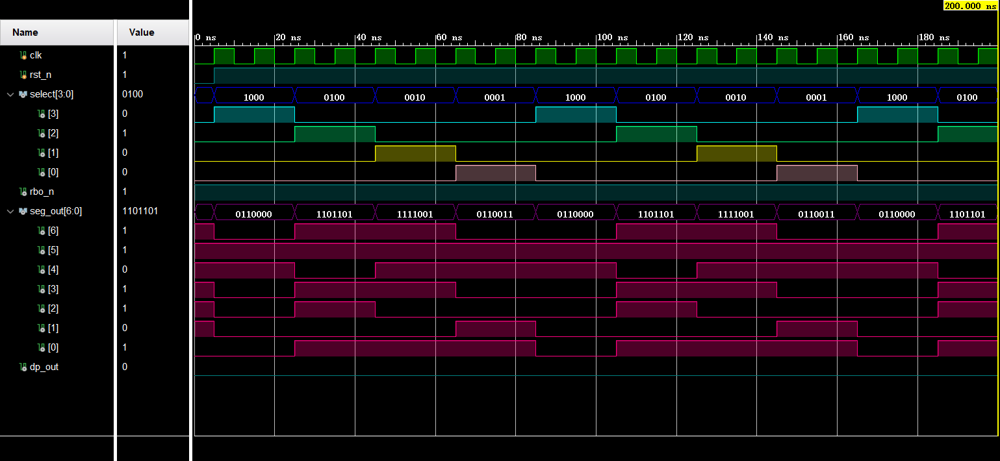
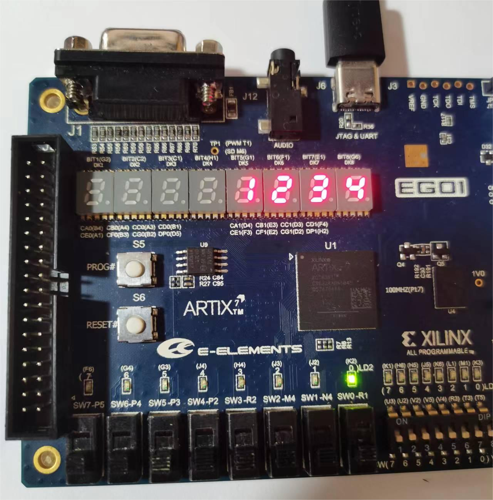
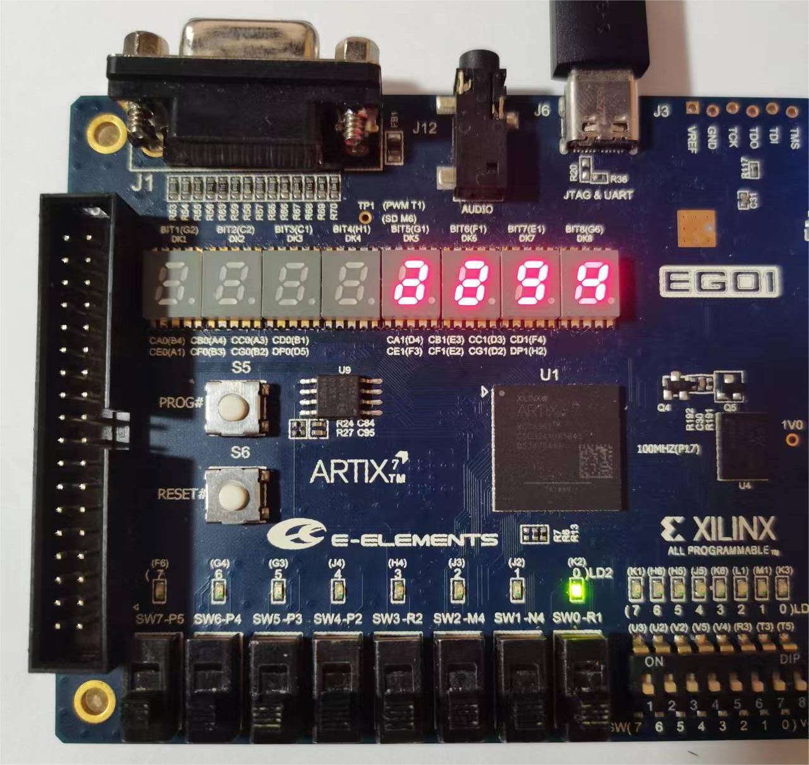

# 实验三报告

[TOC]

## 实验内容

数码管扫描电路

## 设计思路

七段数码管与实验一完全相同。本试验需要设计一个循环点亮数码管的模块。

这个模块的输出为数码管的位选信号，用来控制$4$个数码管中哪一个亮起，和一个$4$位二进制数，传给七段译码管显示$1-4$这$4$个数字。

为了实现数码管点亮保持多个周期，我们引入了一个新的变量`clk0`作为模块的时钟周期和变量`cnt`用来计数，具体为当`clk`时钟信号每经过$1$个上升沿，`cnt`计数器加$1$，经过$n$个上升沿也就是`cnt`到$n$时，新引入的时钟`clk0`取反，也就是`clk0`的周期为`clk`的$2n$倍。

改变扫描频率，分别将`cnt`计数的边界设定为$2^5,2^{15},2^{25}$

另外，需要设计一个顶层模块实例化扫描模块和七段译码管模块

## 主要代码

- `scan_top.v`

```verilog
`include "scan_display.v"
`include "seven_segment_decoder.v"

module scan_top(
    clk    ,
    rst_n  ,

    select ,

    rbo_n  ,  // 灭零信号输出
    seg_out,  // 七段数码管显示输出
    dp_out    // 小数点显示信号
);
    input          clk    ;
    input          rst_n  ;

    output  [3:0]  select ;

    output         rbo_n  ;
    output  [6:0]  seg_out;
    output         dp_out ;

    wire    [3:0]  segment;

    scan_display u_scan_display(
        .clk     ( clk     ),
        .rst_n   ( rst_n   ),
        .select  ( select  ),
        .segment ( segment )
    );

    seven_segment_decoder u_seven_segment_decoder(
        .din     ( segment   ),
        .ib_n    ( 1'b1      ),
        .lt_n    ( 1'b1      ),
        .rbi_n   ( 1'b1      ),
        .rbo_n   ( rbo_n     ),
        .seg_out ( seg_out   ),
        .dp_out  ( dp_out    )
    );


endmodule
```

- `scan_display.v`

```verilog
/*
 * 扫描控制模块
 * 输入：时钟信号
 * 输出：位选信号, 段选信号
 */


module scan_display(
    clk    ,  // 时钟信号
    rst_n  ,  // 复位信号
    select ,  // 数码管位选
    segment   // 输出
);
    input               clk    ;
    input               rst_n  ;
    output  reg  [3:0]  select ;
    output  reg  [3:0]  segment;

            reg         clk0   ;
            reg  [95:0] cnt    ;

    // cnt
    always @(posedge clk or negedge rst_n)
    begin
        if (!rst_n)
            begin
                cnt <= 0;
            end
        else if (cnt >= 67108864)
            begin
                cnt <= 0;
            end
        else
            begin
                cnt <= cnt + 1'b1;
            end
    end

    // clk0
    always @(posedge clk or negedge rst_n)
    begin
        if (!rst_n)
            begin
                clk0 <= 0;
            end
        else if (cnt == 67108864)
            begin
                clk0 <= ~clk0;
            end
    end


    // select
    always @(posedge clk0 or negedge rst_n)
    begin
        if (!rst_n)
            begin
                select <= 4'b0000;
            end
        else
            begin
                case (select)
                    4'b1000:
                        begin
                            select <= 4'b0100;
                        end
                    4'b0100:
                        begin
                            select <= 4'b0010;
                        end
                    4'b0010:
                        begin
                            select <= 4'b0001;
                        end
                    4'b0001:
                        begin
                            select <= 4'b1000;
                        end
                    default: select <= 4'b1000;
                endcase
            end
    end

    // segment
    always @(*)
    begin
        if (!rst_n)
            begin
                segment <= 4'b0000;
            end
        else
            begin
                case (select)
                    4'b1000:
                        begin
                            segment <= 4'b0001;
                        end
                    4'b0100:
                        begin
                            segment <= 4'b0010;
                        end
                    4'b0010:
                        begin
                            segment <= 4'b0011;
                        end
                    4'b0001:
                        begin
                            segment <= 4'b0100;
                        end
                    default: segment <= 4'b0000;
                endcase
            end
    end

endmodule

```

## 仿真结果

仿真时将计数器边界设为$0$，即`clk0`与`clk`周期相同，仿真结果如下



## 测试结果与分析

- 每个数码管点亮时间保持$2^{26}$

在这个刷新频率下，$4$个管每隔$0.6$秒切换一次，测试结果见附件视频。

- 每个数码管点亮时间保持$2^{16}$

由于视觉暂留，在这个刷新频率下，肉眼分辨不出它在刷新，所以看到的结果为$4$个管同时显示。



- 每个数码管电亮时间为$2^{6}$

由于刷新频率过快，看到的结果为乱码。

